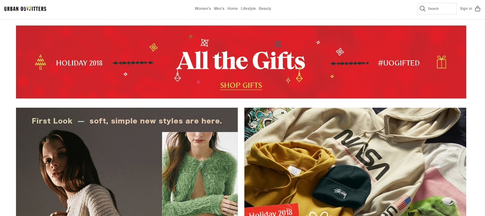
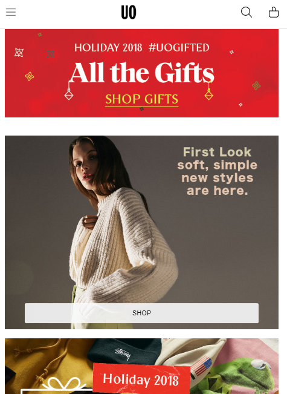
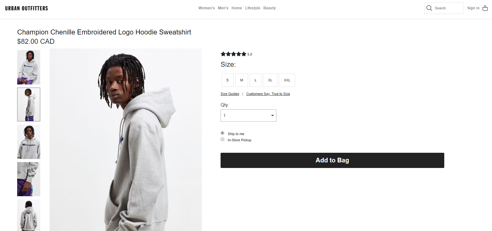
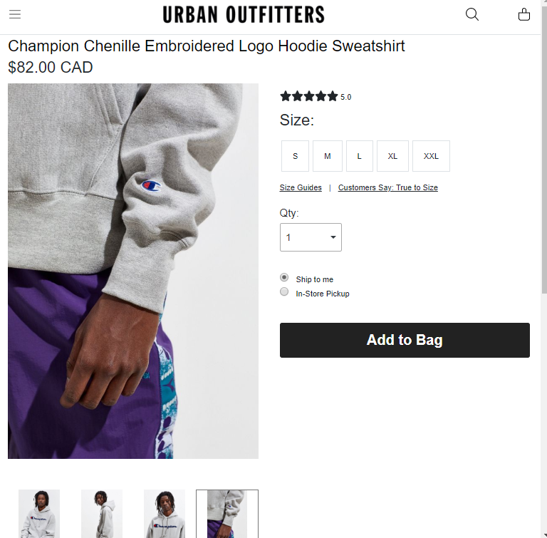
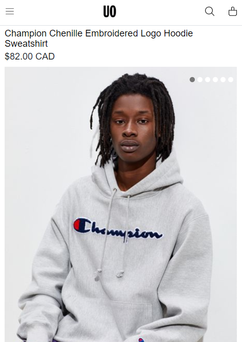
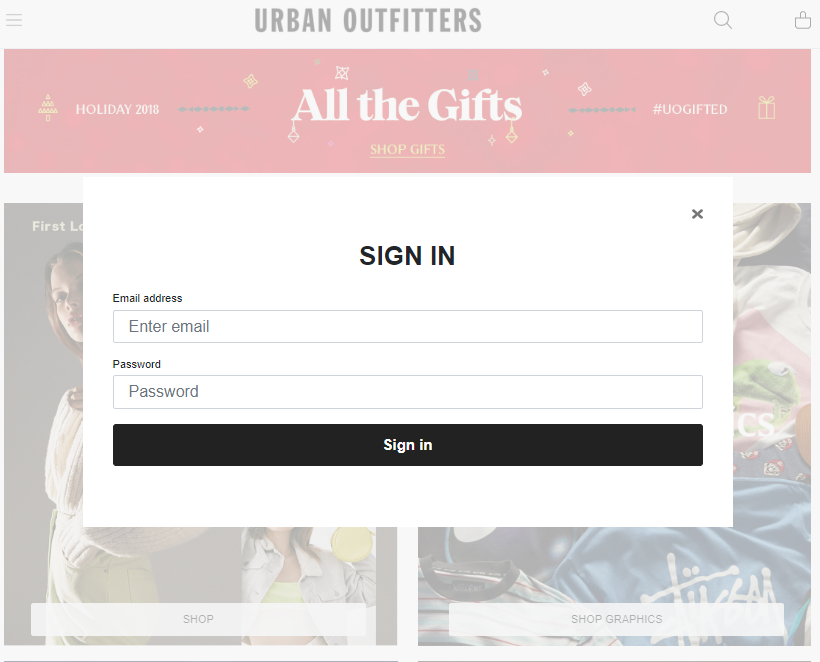

# Urban-Outfitters
React and Bootstrap 4 (Reactstrap) to create a simmilar website to Urban Outfitters. Focused in responsiveness and design.

## Why I picked React + Bootstrap (Reactstrap) And What I've Learned

Pros of the stack:
- React offers VDOM manipulation, making it faster in re-building the layout after a DOM changes.
- React offers components for re-usability and organizaiton of features/layouts. 
- Bootstrap offers quick layouts and features to manipulate and utilize.

Cons of the Stack:
- The need to use Bootstrap grids for layout is solved by flex and CSS grids.
- Features used from Reactstrap like the dropdown in the header requires jQuery and Popper.js to function. It directly manipulates the DOM, defeating the purpose of the VDOM.

What I've learned:
- React, Bootstrap.
- Not to overuse Refs. It directly manipulates the DOM, defeating the purpose of the VDOM. Focus on setState and class manipulation.A usefull case of using it would be to get a value from a form.
- Responsiveness for all screens.
- Proper JPG, PNG, SVG, Gif usages.

Cons of the whole project - Things to improve on:
- No minificaiton/uglification/optimizaiton. 
- No linters and type checkers used.
- No types of testing.
- PostCSS is not used to detect/use pre-fixes.
- Know more about SVG.
 

## What It Looks Like







## Getting Started

These instructions will get you a copy of the project up and running on your local machine for development and testing purposes. See deployment for notes on how to deploy the project on a live system.

Clone the project. Use `npm install` to install all the dependencies.

### Prerequisites

What things you need to install the software

```
- Any package manager (npm, yarn)

```

## Versioning

None


